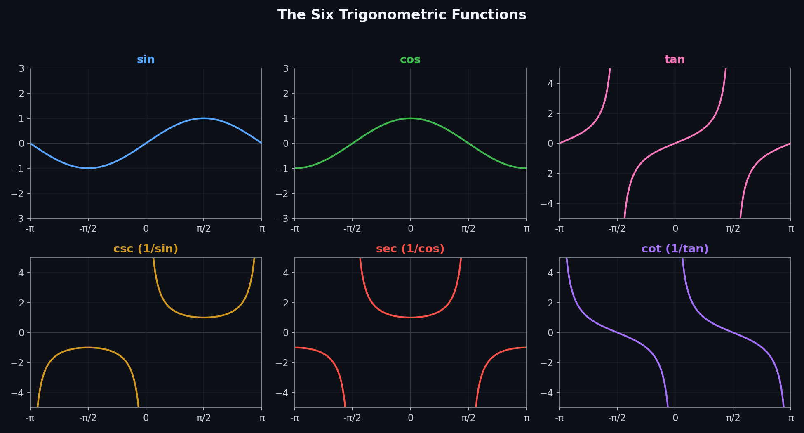
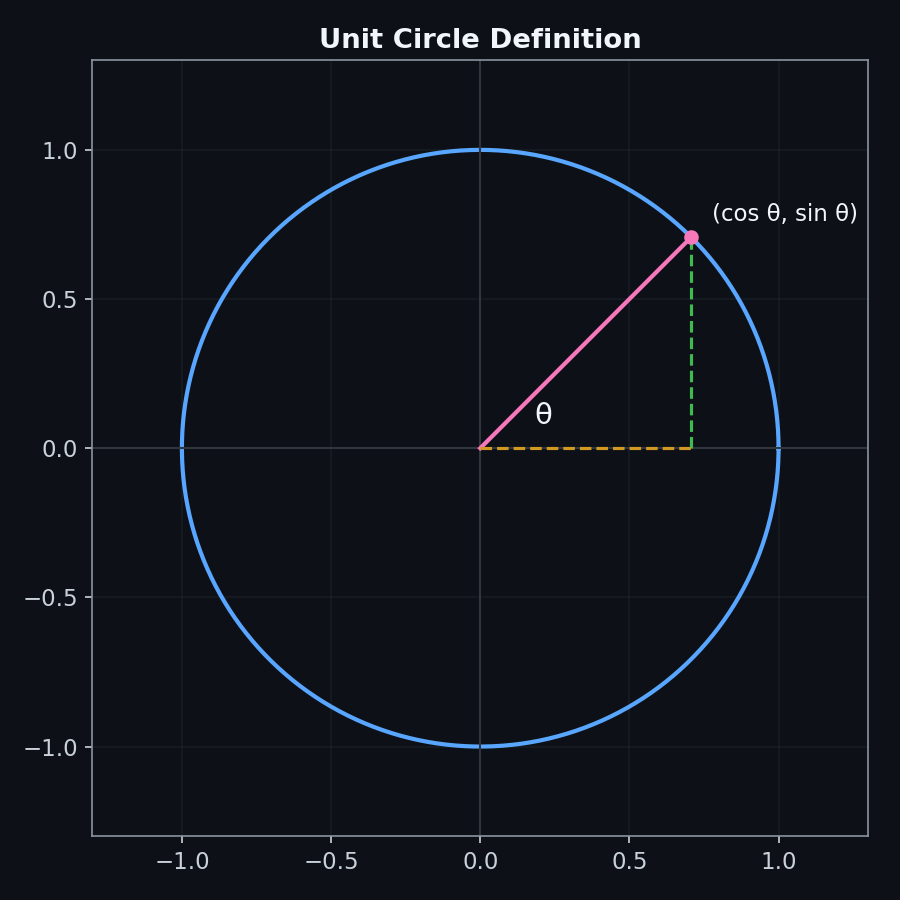
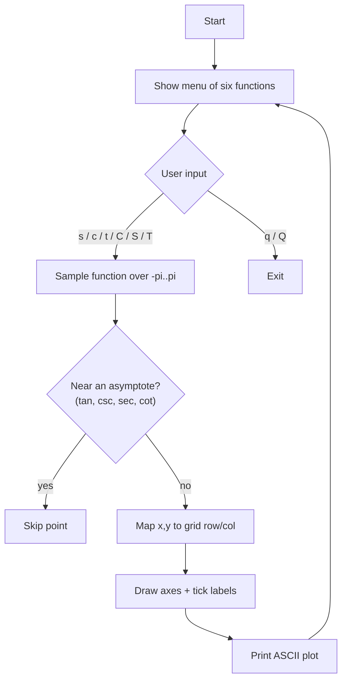

# Trigonometric Function Visualizer

A small C++ command-line tool that plots sine, cosine, tangent, cosecant, secant, and cotangent as ASCII art, right in your terminal.



## How it works

The program samples a trig function across `[-π, π)`, maps each `(x, y)` pair onto an 80×30 character grid, and draws axes, tick labels, and the curve using plain ASCII.





## Example output

Running the program and selecting `s` for sine produces:

```
sine (x-axis in tenths of radians, y-axis clamped to [-5, 5])

                                        + 5
                                        |
                                        |
                                        + 4
                                        |
                                        |
                                        + 3
                                        |
                                        |
                                        + 2
                                        |
                                        |
                                        + 1      ***** ****************
                                        |   *****                      *****
                                        ****                                ****
*****---+-------+-------+-------+---****+-------+-------+-------+-------+-------
31   *****     -19     -13     *****    |       6      13      19      25
          *********************         |
                                        + -1
                                        |
                                        |
                                        + -2
```

## Features

- **Six functions** — sine, cosine, tangent, cosecant, secant, cotangent, selected from a simple menu.
- **Asymptote-aware rendering** — points near a division-by-zero (e.g. `tan(x)` at `x = π/2`) are skipped instead of producing garbage output.
- **Clamped y-axis** — reciprocal functions are capped at ±5 so a single spike near an asymptote doesn't dwarf the rest of the curve.
- **Labeled axes** — both axes carry numeric tick marks so you can read values directly off the plot.
- **No dependencies** — just the C++ standard library.

## Getting Started

### Requirements

- A C++17-capable compiler (g++, clang++, or MSVC)
- Optionally, [CMake](https://cmake.org/) 3.10+

### Build with g++

```bash
g++ -std=c++17 -O2 main.cpp -o visualizer
./visualizer
```

### Build with CMake

```bash
cmake -B build
cmake --build build
./build/trig_visualizer
```

### Usage

1. Run the compiled executable.
2. Type one of the letters below and press Enter:

   | Key | Function  | Ratio                 |
   |-----|-----------|------------------------|
   | `s` | sine      | opposite / hypotenuse  |
   | `c` | cosine    | adjacent / hypotenuse  |
   | `t` | tangent   | opposite / adjacent    |
   | `C` | cosecant  | hypotenuse / opposite  |
   | `S` | secant    | hypotenuse / adjacent  |
   | `T` | cotangent | adjacent / opposite    |
   | `q` | quit      | —                       |

3. The plot prints immediately, then you're returned to the menu to try another function.

## Project structure

```
.
├── main.cpp                     # Program source
├── CMakeLists.txt                # CMake build config
├── LICENSE                       # MIT license
├── assets/
│   ├── generate_diagrams.py      # Regenerates the README diagrams
│   ├── functions_overview.png
│   └── unit_circle.png
└── README.md
```

## Regenerating the diagrams

The reference plots in this README were generated with matplotlib and are checked into `assets/` so they render on GitHub without any extra tooling. To regenerate them after a change:

```bash
pip install matplotlib numpy
python assets/generate_diagrams.py
```

## License

This project is licensed under the MIT License — see [LICENSE](LICENSE) for details.
